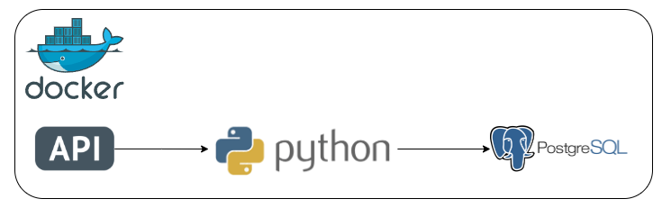

# Projeto De Engenharia de Dados: Ingestão de dados por API

  
## Introdução

Este projeto foi desenvolvido para coletar, processar e armazenar dados da API TMDB, uma fonte pública e gratuita de informações sobre filmes e séries. A aplicação é implementada em Python, seguindo princípios de programação orientada a objetos, e utiliza a biblioteca pandas para estruturar e manipular os dados em DataFrames.

Para garantir um ambiente de execução isolado e padronizado, a infraestrutura é containerizada com Docker Compose, proporcionando maior escalabilidade, portabilidade e facilidade na implantação. Os dados extraídos são armazenados em um banco PostgreSQL.

## Tecnologias Utilizadas

-  **Python**: Linguagem principal para fazer requisições à API e processar os dados.

-  **PostgreSQL**: Banco de dados para armazenar os dados brutos e transformados.

-  **Docker Compose**: Para containerizar o ambiente e orquestração dos container.
  

## Arquitetura

  

  

## Etapas da construção do projeto

  
### 1. Análise do funcionamento da API

O desenvolvimento deste projeto começou com uma análise detalhada da API TMDB, incluindo a compreensão da sua estrutura, endpoints disponíveis e parâmetros necessários para a extração eficiente dos dados. Para isso, foi utilizada a [documentação oficial](https://developer.themoviedb.org/docs/getting-started) como referência.

A extração das informações é realizada por meio de requisições HTTP utilizando o método GET, permitindo a coleta dos dados essenciais. Após a extração, os dados passam por um processo de transformação e organização antes de serem armazenados de forma estruturada no banco de dados PostgreSQL.

### 2. Lógica das classes

O arquivo [main.py](src/classes/main.py) é responsável por coordenar o fluxo completo de extração, processamento e armazenamento dos dados obtidos a partir da API TMDB. Seu principal objetivo é garantir que as informações sejam corretamente coletadas, transformadas e inseridas no banco de dados PostgreSQL, seguindo um fluxo estruturado e eficiente. Neste projeto, são utilizados dois endpoints específicos que retornam os filmes ou séries mais populares do TMDB com base nas tendências diárias.

A aplicação é organizada em classes especializadas, cada uma com uma responsabilidade específica:

1.  [**API**](src/classes/api.py) - Classe responsável por realizar requisições HTTP para a API TMDB, coletando dados sobre filmes e séries de forma estruturada.

2.   [**Manipulador de diretório**](src/classes/manipuladiretorio.py)  -  Classe responsável por gerenciar o armazenamento dos arquivos de dados, incluindo:

- Criação do diretório de armazenamento;

- Geração de nomes de arquivos padronizados;

- Conversão dos dados de JSON para CSV;

- Salvamento dos arquivos no diretório designado.

3.   [**PostgreSQL**](src/classes/postgresql.py)  -  Classe responsável encarregada das operações no PostgreSQL, incluindo:

- Criação de tabelas para armazenar os dados extraídos;

- Inserção dos registros coletados da API;
  
- Execução de consultas e outras operações no banco de dados.

## Pré-Requisitos

- Instalar o Docker e Docker Compose em sua máquina.
- Configurar as variáveis de ambiente no arquivo .env (há um exemplo que pode ser utilizado no repositório)

## Executando o Projeto

Siga os passos abaixo para executar este projeto:

1. Copie o diretório do projeto para uma pasta local em seu computador.

2. Abra o terminal do seu computador no diretório do projeto.

3. Vamos executar o docker compose pra começar o fluxo da coleta de dados.

- Utilize o seguinte comando para isso: `docker compose up -d`
4. Você pode visualizar os logs na pasta do projeto pra verificar se o pipeline de dados executou corretamente.
	- Os logs são gerados pela biblioteca logging.
	- Os logs são salvos dentro do arquivo logs_pipeline.log (há um exemplo no repositório)